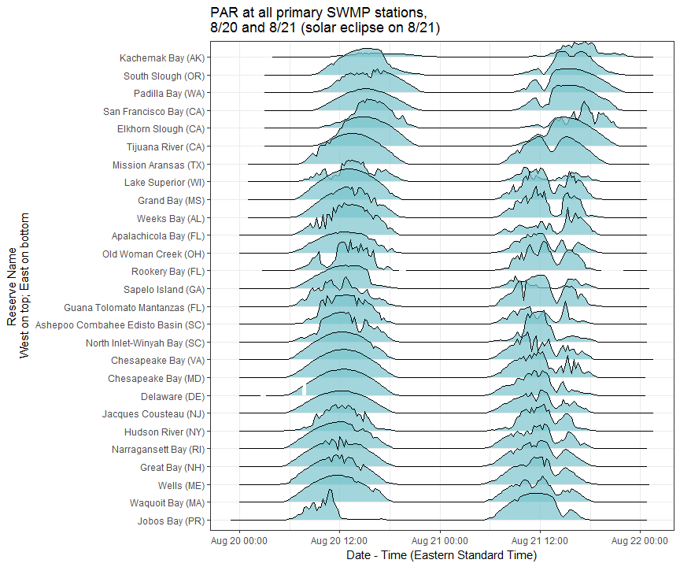

# Solar Eclipse Visualizations
`r Sys.Date()`  


### Data wrangling  

I downloaded temp and PAR data for all reserves, from 8/20/2017 - 8/22/2017, around 08:00 CST on 8/22. All times are in local standard time, which could be an interesting way to start looking at things, but I will eventually want to put everything in GMT.  

I started by opening a few of my favorite packages, reading in the data, and seeing what I had to work with. There were some trailing spaces (quite a few, actually) in the station information file; turns out there's a command that can be specified within `read.csv()` to elminate white space as you're importing a file: `strip.white = TRUE`. That actually didn't work for station names in my main data file - not sure why - but Stack Overflow had an answer; writing a custom function to trim trailing spaces. 

In the data cleaning steps, I also did some subsetting and column selection.


```r
library(tidyverse)
library(lubridate)
library(ggplot2)
library(ggjoy)


# read in data
dat <- read.csv("par_all.csv", stringsAsFactors = FALSE, strip.white=TRUE)
trim.trailing <- function (x) sub("\\s+$", "", x)
dat$StationCode <- trim.trailing(dat$StationCode)


# clean data; only keep data that's from a primary SWMP station; get datetimestamp into POSIXct using lubridate::mdy_hm
dat <- dat %>%
    filter(isSWMP == "P") %>%
    select(-isSWMP, -F_Record, -X) %>%
    mutate(datetimelocal = mdy_hm(DateTimeStamp))

# deal with sampling stations; only keep the ones that are in my downloaded data file
stns <- read.csv("sampling_stations.csv", stringsAsFactors = FALSE, strip.white=TRUE)
stns <- stns %>%
    select(NERR.Site.ID, Station.Code, State, Reserve.Name, GMT.Offset, Longitude) %>%
    filter(Station.Code %in% unique(dat$StationCode)) %>%
    mutate(State = toupper(State))


# join tables together
datfull <- left_join(dat, stns, by = c("StationCode" = "Station.Code"))

# generate a GMT time stamp column and an Eastern Standard Time column; get rid of the character DateTimeStamp column; glue the State to the back of the Reserve name
datfull <- datfull %>%
    mutate(datetimeGMT = datetimelocal - hours(GMT.Offset),
           datetimeEST = datetimelocal - hours(GMT.Offset) - hours(5),
           Reserve.Name = paste0(Reserve.Name, " (", State, ")")) %>%
    select(-DateTimeStamp) %>%
    group_by(StationCode)
```


### Joyplots!!! 


The eclipse started along the west coast, and moved east. It was morning at our west coast reserves. In the following graph, the westernmost MET station is at the top, and the easternmost is at the bottom.  

The plot contains two days of data - 8/20, so you can see a "normal" day, and 8/21, eclipse day!  

All times have been adjusted to Eastern Standard Time. If you start at the bottom and move up, you can see that daylight starts later at the western reserves than at the eastern ones.  

And when you start at the top and move down, you can see the dip in PAR caused by the eclipse, and how it moved across the country!


```r
# arrange reserves by longitude and assign a factor level
f_reservename <- datfull %>%
    ungroup() %>%
    select(Reserve.Name, Longitude) %>%
    distinct() %>%
    arrange(desc(Longitude)) %>%
    mutate(factorid = rank(Longitude))

# use those factor levels to turn Reserve.Name in the main data frame into a factor, ordered thusly
datfull$Reserve.Name <- factor(datfull$Reserve.Name, levels = unique(f_reservename$Reserve.Name[order(f_reservename$factorid)]))


ggplot(datfull, aes(x = datetimeEST, y = Reserve.Name, height= TotPAR)) +
    geom_joy(stat = "identity", alpha = 0.7, fill = "cadetblue3") +
    theme_bw() +
    ggtitle("PAR at all primary SWMP stations, \n8/20 and 8/21 (solar eclipse on 8/21) \nEastern Standard Time") +
    ylab("Reserve Name (West on top; East on bottom)") +
    xlab("Date and Time - Eastern Standard Time")
```

<!-- -->

